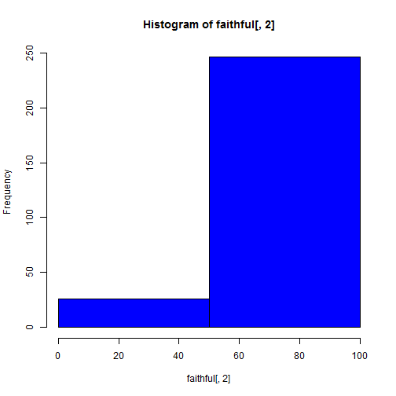

## Slide 1

- This is the Course Project of Developing Data Products: Shiny Application and Reproducible Pitch.
- This app is a simple extension of example from Shiny tutorial. We have some data, one variable( Waiting time to next eruption (in mins) ) from Old Faithful Geyser Data.

--- .class #id 

## Slide 2

Use numericInput to set number of bars of histogram

```r
library(manipulate)
myHist <- function(num){
  hist(faithful[,2],col="blue",breaks=num)
}
manipulate(myHist(num), num = slider(1, 100, step = 5))
```

 

--- .class #id 

## Slide 3

Use sliderInput to set color of bars

```r
library(manipulate)
myHist <- function(color){
  hist(faithful[,2],col=color,breaks=10)
}
manipulate(myHist(color), color = slider(1, 8, step = 1))
```

 

--- .class #id 

## Slide 4

After setting these two parameters you see the values in table under the graph.

--- .class #id

## Slide 5

Thank You for Viewing

--- .class #id 


